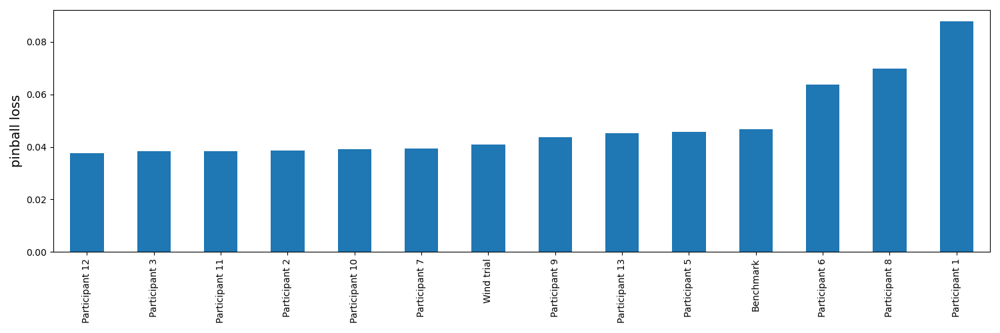
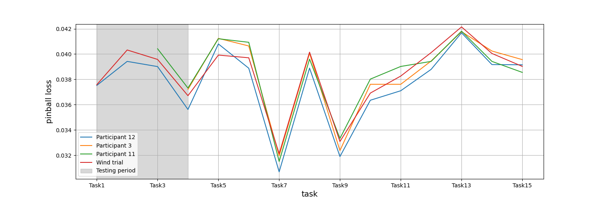
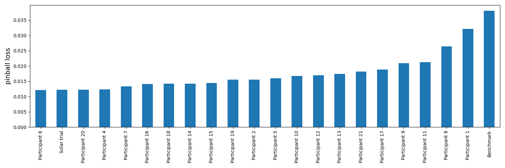
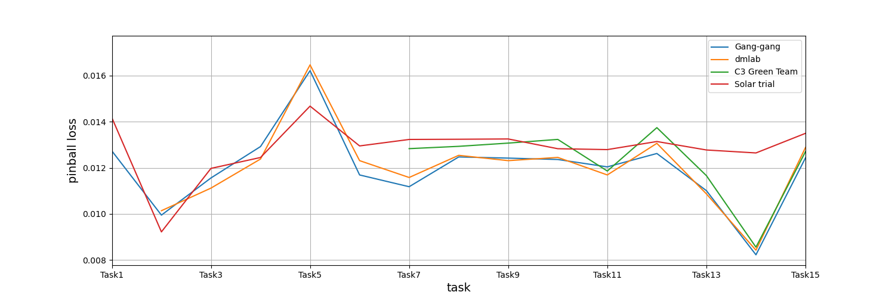

# mqe-forecast

## Introduction
This code, `gbdt-forecast`, is a method for energy and weather forecasting using gradient boosting decision trees. It considers the forecasting problem as a tabular problem without the  spatio-temporal aspects included in the modelling prior. Instead spatio-temporal features can be included as (lagged) features in the tabular data. The code integrates four most popular gradient boosting implementations:

##### 1) [`lightgbm`](https://lightgbm.readthedocs.io/en/latest/) ([Link to LightGBM paper](https://papers.nips.cc/paper/6907-lightgbm-a-highly-efficient-gradient-boosting-decision-tree.pdf))
##### 2) [`xgboost`](https://xgboost.readthedocs.io/en/latest/) ([Link to XGBoost paper](https://arxiv.org/pdf/1603.02754.pdf))
##### 3) [`catboost`](https://catboost.ai/) ([Link to CatBoost paper](https://arxiv.org/pdf/1706.09516.pdf))
##### 4) [`scikit-learn`](https://scikit-learn.org/stable/modules/generated/sklearn.ensemble.GradientBoostingRegressor.html#sklearn.ensemble.GradientBoostingRegressor)

## Performance benchmark on GEFCom2014 competition dataset

### Wind power forecasting



### Solar power forecasting
The solar power forecasting benchmark is performed using the parameters in `params/params_gefcom2014_solar_competition.json`.




## Data sensitivity analysis on GEFCom2014 competition dataset

## Installation
Clone and install the necessary libaries through conda.

```
git clone git@github.com:greenlytics/gbdt-forecast.git
conda env create -f environment.yml
conda activate gbdt-forecast
```

## Quick start
Download the [GEFCom2014 data](https://drive.google.com/file/d/1gKSe-OMVICQ5ZcBD_jvtAPRuamTFwFqI/view?usp=sharing) and place the file `1-s2.0-S0169207016000133-mmc1.zip` in the `data` folder.

To replicate the results above run the following scripts:

```
./run_gefcom2014_load.sh
./run_gefcom2014_solar.sh
./run_gefcom2014_wind.sh
```

The results will be saved to the `results` folder and plots will be saved to `plots` folder.

## Walkthrough of the pipeline

### 1) Download data
Download the [GEFCom2014 data](https://drive.google.com/file/d/1rLEGySZZYTt-2JFWziX3IwfAdC4iQCV6/view?usp=sharing) and place the file `1-s2.0-S0169207016000133-mmc1.zip`in the `data` folder. 

### 2) Extract data
Extract the data by running:

```
python preprocess/extract_gefcom2014_wind_solar_load.py
```

the raw data files will be saved to:

```
Wind track data saved to: ./data/raw/gefcom2014-wind-raw.csv
Solar track data saved to: ./data/raw/gefcom2014-solar-raw.csv
Load track data saved to: ./data/raw/gefcom2014-load-raw.csv
```

### 3) Preprocessing the GEFCom2014 data
Next step is to preprocess the data with feature extraction relavent for the forecasting task at hand. This repo includes examples of feature extraction for the different GEFCom2014 tracks:

```
preprocess/preprocess_gefcom2014_wind_example.py
preprocess/preprocess_gefcom2014_solar_example.py
preprocess/preprocess_gefcom2014_load_example.py
```

These preprocessing scripts should be updated with the relevant feature engineering and takes input from the parameter files. To run the preprocessing script for the wind track (other tracks are analog) as:

```
python preprocess/preprocess_gefcom2014_wind_example.py params/params_competition_gefcom2014_wind_example.json
```

the processed data file will be saved to:

```
Wind track preprocessed data saved to: ./data/gefcom2014/preprocessed/gefcom2014-wind-preprocessed.csv
```

### 4) Train models and predict
To train models, predict and save the results run the following script:

```
python ./main.py params/params_competition_gefcom2014_wind_example.json
```

The results will be saved to the `results` folder. Train models for other tracks by changing the parameters file.

### 5) Generate plots
Lastly, generate plots by running the following:

```
python ./plots/generate_plots_wind.py
```

Plots will be saved to the `plots` folder.

## Different pipeline
Right now the train is both the create model and the fit step. This means it is not possible to partially train a model. Should this be supported in the future? 

### Methods in `Trial`
The methods in the `Trial` class is given 
Should it be renamed to `MQForecast` instead? 

* `load_data`
* `generate_dataset`
* `generate_dataset_split_site`
* `create_model`
* `fit_model`
* `train_mq`
* `predict_mq`
* `predict_mq_model_split_site`
* `calculate_loss`
* `calculate_loss_split_site`

### `run_pipeline`
This is used for training models for several splits and sites. 

1) `generate_dataset_split_site`
2) `train_model_split_site`
3) `predict_model_split_site`
4) `calculate_loss_split_site`

### `run_pipeline_parallel`
This is used for training models for several splits and sites in parallel. 

1) `generate_dataset`
2) `train_q`
3) `predict_q`
4) `calculate_loss`

### `run_pipeline_cross_validation`
This is used for training models for several cross validations splits and sites. Need to thing about this one if it is possible since we need to overwrite the predict function somehow. 
Should be possible: https://stackoverflow.com/questions/52679784/post-process-cross-validated-prediction-before-scoring

1) `generate_dataset_cv`
2) `train_q`
3) `predict_q`
4) `calculate_loss`

### `run_pipeline_predict`
This is used for making operational predictions. 

1) `generate_dataset`
2) `load_model_q`
3) `predict_q`

## Acknowledgement
The authors of this code would like to thank the Swedish Energy Agency for their financial support for this research work under the grant VindEL projects number: 47070-1 and 44988-1.
